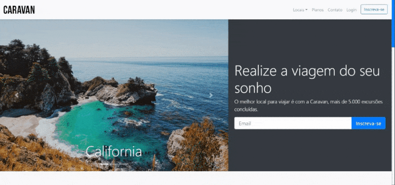
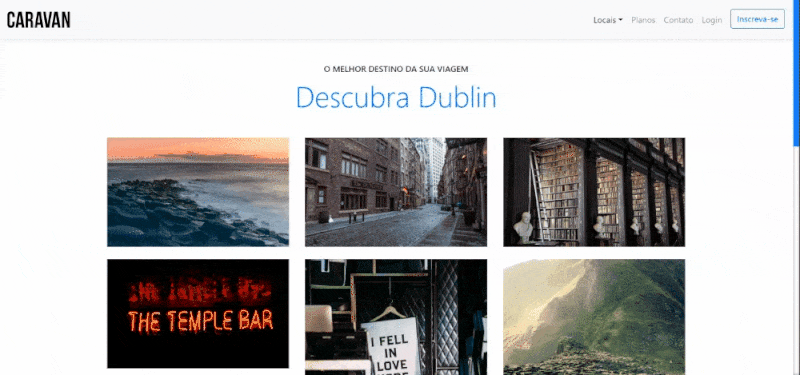
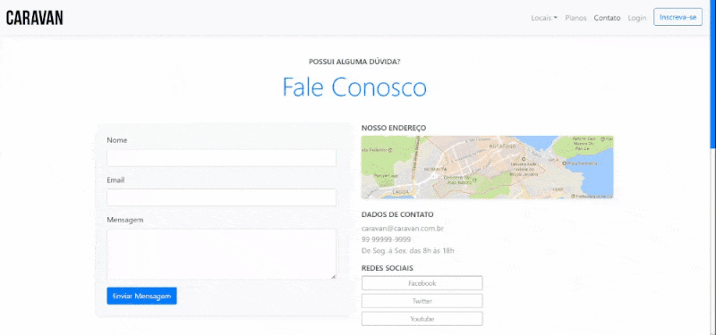
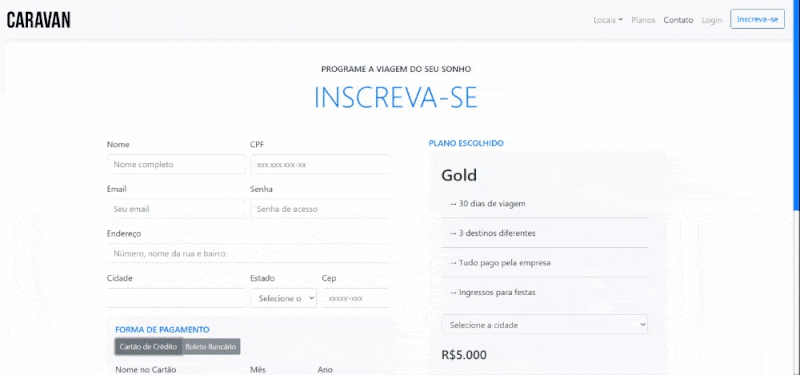

# Caravan - Travel agency🧑‍✈️

## About The Project

- Front-End travel agency website

### Pages/Paginas

- Home/Inicio
- Locations/Locais
- Plans/Planos
- Contacts/Contatos
- Sign up/Inscreva-se

### 🛠️ Tools/Ferramentas

- HTML5
- CSS3
- JavaScript ES6+
- Bootstrap
